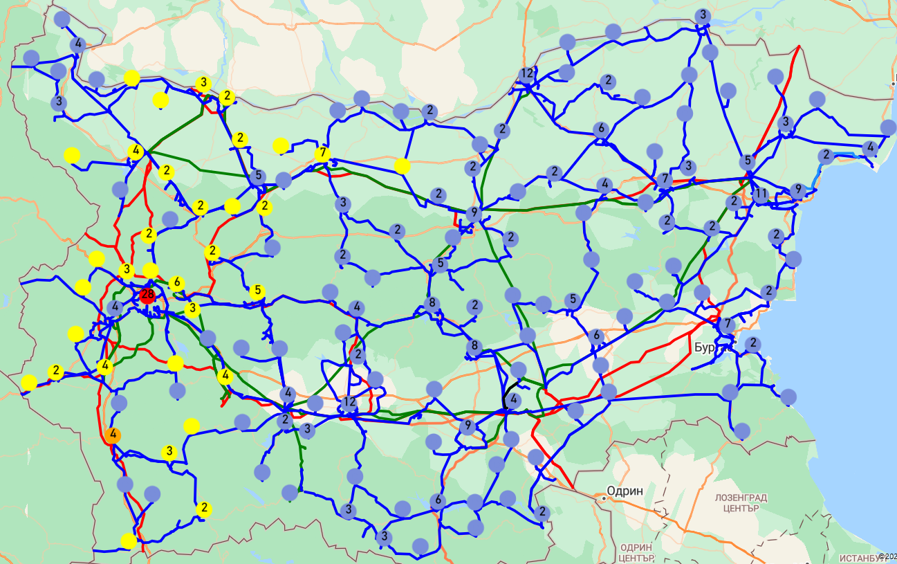
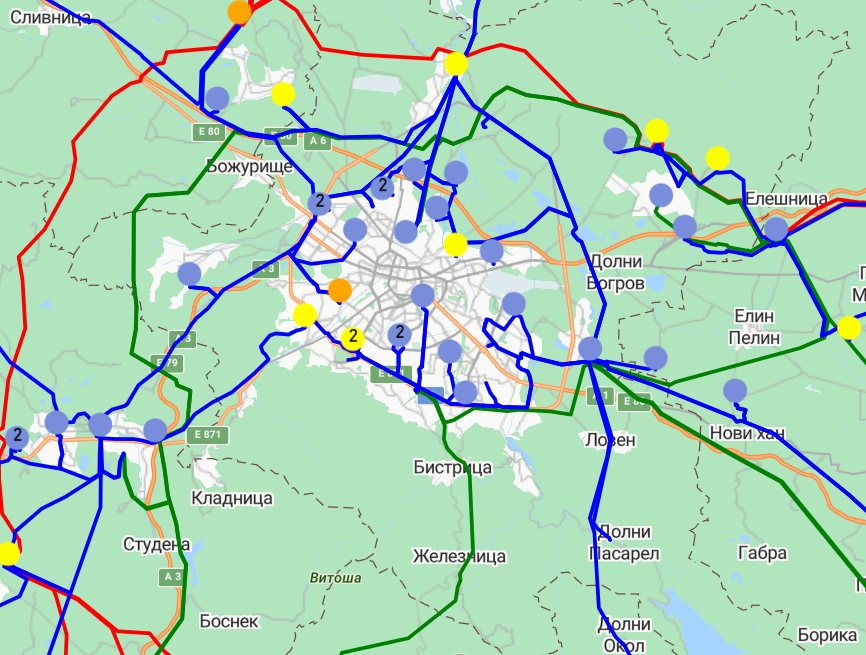
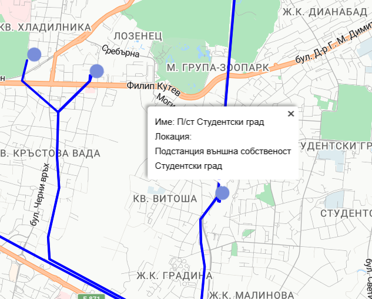
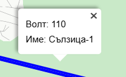
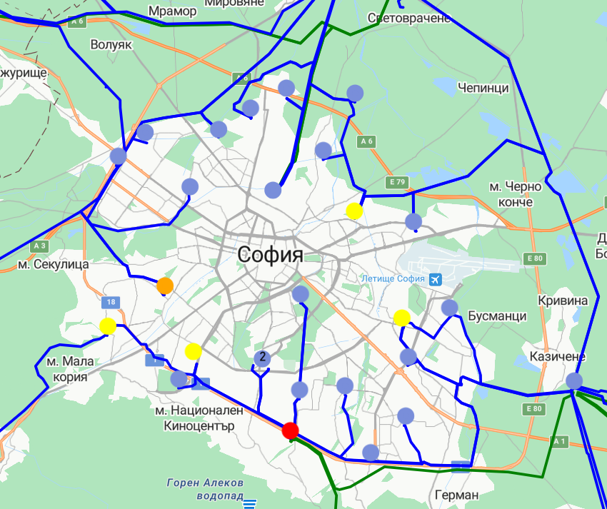

# Интерактивна карта с Azure Maps SDK, React и Node.js

Проектът демонстрира създаването на **интерактивна карта**, използвайки **Azure Maps SDK**, **React.js** и **Node.js**. Реализацията включва работа както с **legacy функционалност**, така и с **новия подход** за изграждане на ГИС приложения.  

## Цели на проекта
- Създаване на базова визуализация върху карта.  
- Изчертаване на точкови обекти и визуализиране на свързана информация (цветово и текстово).  
- Изчертаване на линейни обекти и визуализиране на техните характеристики.  
- Интеграция с база данни за извличане и представяне на данни.  
- Добавяне на допълнителни функционалности към картата, изградена чрез новия подход.  

## Използвани технологии
- **React.js** – фронтенд.  
- **Azure Maps SDK** – визуализации и работа с картата.  
- **Node.js (Express)** – бекенд и API.  
- **MS SQL** – база данни.  

## Визуализация
  
  
  
  
  
